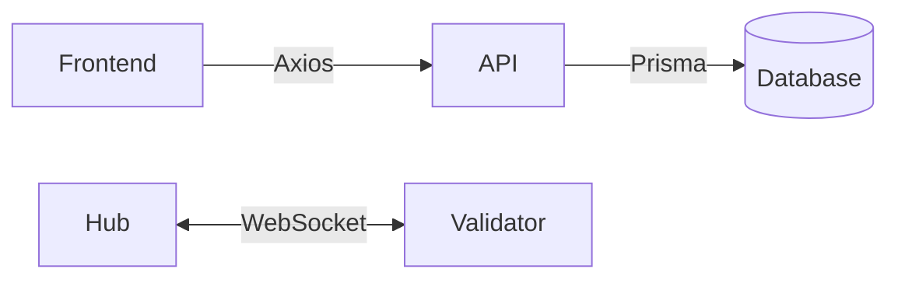

# **DePin Uptime Platform**  

  
  
  

A decentralized monitoring tool for tracking uptime, performance, and reliability of DePin (Decentralized Physical Infrastructure) networks with real-time WebSocket communication.

---

## **🚀 Features**  
- **Real-time monitoring** via WebSocket (Hub ↔ Validator)  
- **Next.js dashboard** with authentication (Clerk)  
- **Prisma ORM** with PostgreSQL for reliable data storage  
- **Monorepo architecture** with Turbo for efficient development  
- **End-to-end TypeScript** for type safety  

---

## **⚙️ Tech Stack**  

### **Frontend (`apps/frontend`)**  
- **Framework**: Next.js 15.2.3 (React 19)  
- **Styling**: TailwindCSS + Radix UI  
- **Auth**: Clerk  
- **HTTP**: Axios  
- **Utilities**: clsx, class-variance-authority  

### **Backend (`apps/api`)**  
- **Runtime**: Express.js (TypeScript)  
- **Auth**: JWT  
- **Security**: CORS enabled  

### **Validator Service (`apps/validator`)**  
- **Runtime**: Bun  
- **Communication**: WebSocket client  

### **Hub Service (`apps/hub`)**  
- **Communication**: WebSocket server  

### **Database (`packages/db`)**  
- **ORM**: Prisma (PostgreSQL)  

### **Dev Tools**  
- **Runtime/PM**: Bun  
- **Monorepo**: Turbo  
- **Linting**: ESLint + Prettier  
- **Type Safety**: TypeScript  

### **Infrastructure**  
- **Containerization**: Docker  
- **Project Structure**: Workspace-based monorepo  

---

## **📡 Architecture Overview**  



### **Flow Explanation:**

- Frontend communicates with API via HTTP
- API persists data to Database via Prisma
- Hub and Validator maintain persistent bidirectional WebSocket connection:
- Hub pushes status updates to Validator
- Validator sends health reports back to Hub

---

## **🛠 Setup & Installation**

### **1. Prerequisites**
Ensure your system has:
- [Node.js](https://nodejs.org/) (v18 or higher)
- [Docker](https://www.docker.com/) (v20 or higher)
- [Bun](https://bun.sh/) (v1.0 or higher)

```bash
# Verify installations
node -v
docker --version
bun -v
```

### **2. Clone Repository**
```
git clone https://github.com/your-username/depin-uptime.git
cd depin-uptime
```

### **3. Configure Environment**
```
cp .env.example .env
# Edit the .env file with your specific configurations in every folder that has a .env.example file
```

### **4. Start Docker Services**
```
docker compose up -d
```

### **5. Install Dependencies**
```
bun install
```

### **6. Database Setup**
```
cd packages/db
bun x prisma generate
bun x prisma migrate dev
bun seed.ts
```

### **7 Run Services**
Run each service in a different terminal
```
# API Service
cd apps/api && bun run index.ts

# Hub Service (WebSocket Server)
cd apps/hub && bun run index.ts

# Validator Service (WebSocket Client)
cd apps/validator && bun run index.ts

# Frontend Development
cd apps/frontend && bun run dev
```
---

## **📬 Contact Me**

### **For questions or feedback about this development project:**
- **Name**: Devrat Dave  
- **Email**: [devratdave02@hotmail.com](mailto:devratdave02@hotmail.com)  
- **GitHub**: [@devratdave](https://github.com/devratdave) 
- **GitHub Issues**: [Report bugs/requests](https://github.com/devratdave/depin-uptime/issues) 

### **Connect**
[](https://www.linkedin.com/in/devratdave/)  

---

**Project Link**: [https://github.com/devratdave/depin-uptime](https://github.com/your-username/depin-uptime)
